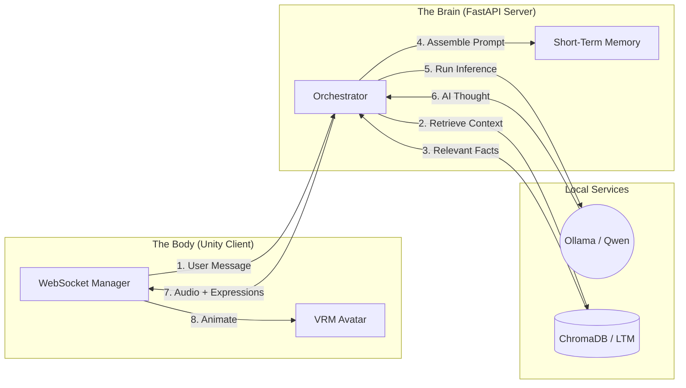

<div align="center">

# 🎙️ Project Echo-Iris

**A real-time 3D conversational agent framework blending a high-performance Python FastAPI backend with an immersive Unity WebGL client.**

[](https://python.org)
[](https://unity.com)
[](#)
[](https://opensource.org/licenses/MIT)
[](#)

<br />

<!-- 
=======================================================================
PLACEHOLDER: DEMO GIF
Replace the image source below with an actual GIF of your WebGL app running.
Keep the file size under 5MB for fast loading.
======================================================================= 
-->


<br />

## 🧩 Architecture Diagram


</div>

<br />

## 🌟 Overview
Project Echo-Iris is a specialized toolkit designed to bring interactive, AI-driven digital workflows to life in the browser. By combining robust backend language models and real-time audio/expression processing with a lightweight Unity WebGL client, it delivers a seamless, embodied conversational AI experience.

The architecture is split into two distinct parts:
1. **The Brain (Backend):** A Python FastAPI server handling WebSockets, local LLM inference (via Ollama), Speech-to-Text (Whisper), Text-to-Speech (ElevenLabs/Azure/Kokoro), and external Tool/Robot integrations.
2. **The Body (Frontend):** A Unity WebGL client that renders an anime-style VRM avatar, handling procedural lip-sync, physical movements, and streaming audio/video to the Brain.

---

## 🏗️ Architecture Overview

### 🧠 The Brain (Python Backend)
- **FastAPI WebSockets:** High-performance concurrent streaming for Audio, Vision, and Tools.
- **Local Intelligence:** Powered by **Ollama** (`qwen2.5:0.5b` by default) for fast, private text generation.
- **Memory Systems:** 
  - **STM:** Sliding window conversational history.
  - **LTM:** Vector database (ChromaDB + Nomic Embeddings) for persistent facts.
- **Audio Subsystem:**
  - **STT:** Local, real-time transcription using `faster-whisper`.
  - **TTS:** High-quality streaming TTS (ElevenLabs out of the box, easily swapped to Azure or Kokoro).
- **Vision Subsystem:** 
  - Real-time object detection (`yolov8n.pt`) and deep scene descriptions (`LLaVA`).
- **Tools & Robotics:** LangChain-powered tool registry for opening local apps, setting timers, and controlling physical hardware over Serial.

### 🏃‍♂️ The Body (Unity Frontend)
- **Transparent Desktop Mascot:** P/Invoke wrappers allow the Unity window to float borderless on your desktop with click-through support so it doesn't interrupt your work.
- **Procedural Real-time Lip-Sync:** Custom Cooley-Tukey FFT analyzes incoming server audio in real-time to detect accurate Japanese vowel patterns (あ, い, う, え, お) and precisely drive VRM blendshapes.
- **Autonomous Roaming:** State machine driving random pacing, idling, and emote tricks along the bottom of your screen.

---

## 🛠️ Prerequisites

Before you begin, ensure you have the following installed:

1. **Python 3.10+** (Required for compatibility with `faster-whisper` and `onnxruntime`).
2. **Ollama:** Download and install from [ollama.com](https://ollama.com).
3. **Unity Editor:** (Recommended: 2022.3 LTS or newer).
4. **uv:** (Optional but recommended) Fast Python package installer.

### Download Required Ollama Models
Before starting the backend, pull the necessary local AI models:
```bash
ollama pull qwen2.5:0.5b
ollama pull nomic-embed-text
ollama pull llava
```

---

## 🚀 Step 1: Starting The Brain (Backend)

The backend must be running before the Unity client can connect.

1. **Open a terminal in the project root directory (`d:\Vtuber`).**

2. **Create and activate a Python virtual environment:**
   *(If you are using `uv`, replace `pip` with `uv pip` for much faster installs).*
   ```powershell
   # Windows PowerShell
   python -m venv .venv
   .\.venv\Scripts\activate
   ```

3. **Install the dependencies:**
   ```powershell
   pip install -r requirements.txt
   ```

4. **Configure your environment:**
   Ensure your `.env` file is properly configured. If you are using ElevenLabs, add your API key:
   ```env
   ELEVENLABS_API_KEY=your_key_here
   OLLAMA_MODEL=qwen2.5:0.5b
   ```

5. **Start the FastAPI Server:**
   ```powershell
   uvicorn app.main:app --host 0.0.0.0 --port 8000 --reload
   ```
   *You should see `Application startup complete.` in the terminal.*

---

## 🎮 Step 2: Starting The Body (Frontend)

1. **Open the project in Unity.**
2. **Ensure your Scene is set up correctly:**
   - Your VRM Avatar should have the `LipSyncController.cs`, `DesktopRoamController.cs`, and `AvatarAnimationController.cs` attached.
   - You should have Manager GameObjects running `EchoIrisManager.cs`, `AudioPlaybackBuffer.cs`, `AudioWebSocketManager.cs`, and `VisionWebSocketManager.cs`.
3. **Attach the Debug UI:**
   Ensure the `EchoIrisDebugUI.cs` script is attached to a GameObject in your scene and all its inspector slots are populated with the correct managers.
4. **Hit PLAY in the Unity Editor.**
5. **Use the Debug UI panel (left side of the screen) to interact:**
   - **👁️ Start Vision Stream:** Triggers the webcam capture and starts YOLO/LLaVA processing on the server.
   - **🎤 Start Recording:** Speaks into your microphone to talk to the AI.
   - **⏸ Stop & Send Audio:** Sends the recording to the backend for Whisper transcription and LLM response.
   - **Send to Brain:** Manually type a text message and mock a send to test the LLM and TTS pipeline.

---

## 🐛 Troubleshooting

- **No Audio / Lip-Sync Not Moving:** Ensure `AudioPlaybackBuffer` is attached to a GameObject with an `AudioSource` component.
- **ModuleNotFoundError on Backend:** Double check that you activated your `.venv` before running `uvicorn`.
- **Ollama Connection Refused:** Ensure the Ollama app is running in your system tray.
- **Pink/Missing Unity Materials:** Make sure you have installed the UniVRM package compatible with your avatar.
