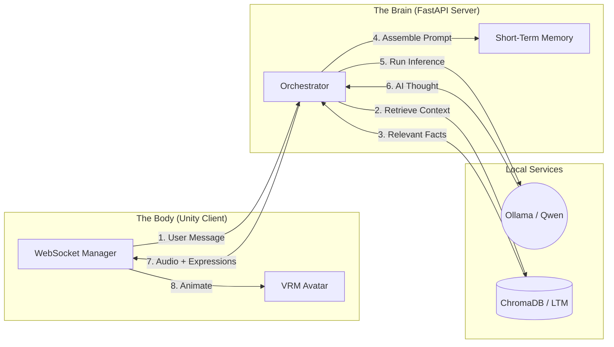

# Project Echo-Iris Architecture

Here is the high-level flow of data from the Unity Body to the Python Brain and Local Services.

```mermaid
graph LR
    subgraph "The Body (Unity Client)"
        U[VRM Avatar]
        W[WebSocket Manager]
    end

    subgraph "The Brain (FastAPI Server)"
        F[Orchestrator]
        S[Short-Term Memory]
    end

    subgraph "Local Services"
        O((Ollama / Qwen))
        C[(ChromaDB / LTM)]
    end

    W -- "1. User Message" --> F
    F -- "2. Retrieve Context" --> C
    C -- "3. Relevant Facts" --> F
    F -- "4. Assemble Prompt" --> S
    F -- "5. Run Inference" --> O
    O -- "6. AI Thought" --> F
    F -- "7. Audio + Expressions" --> W
    W -- "8. Animate" --> U
```
